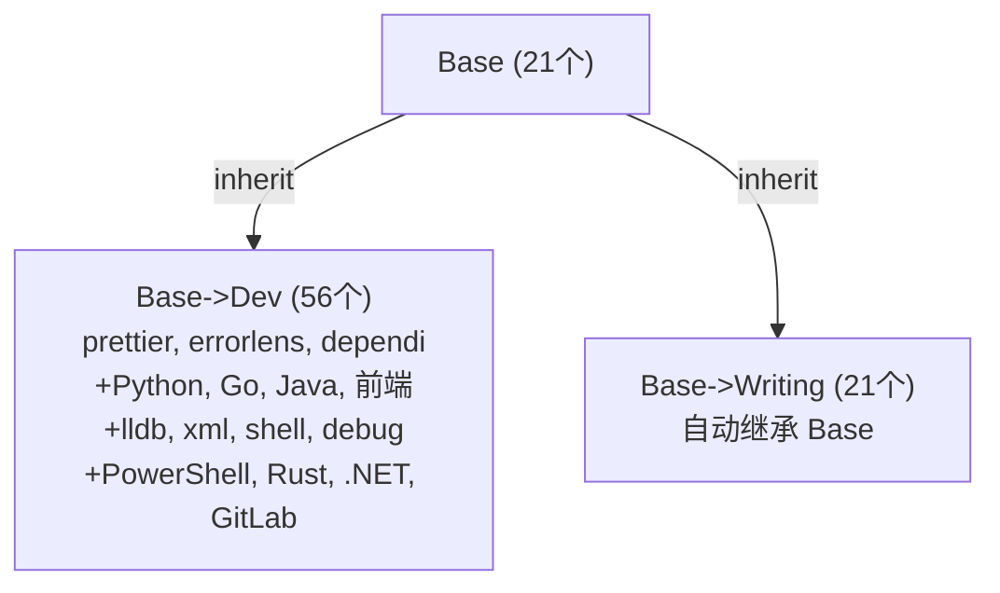

# VS Code Profile 体系 · 完整架构文档

> 最后更新: 2026-07-08

---

## 一、整体架构

```
Base（通用底座·21个）
├── Base->Dev（通用开发工具·56个）
└── Base->Writing（文字写作·21个，自动继承 Base）

Test（未归类文档工具，3个，仅文档规划）
```

---

## 二、Profile 明细

### 2.1 Base · 通用底座（21 个扩展）

**UUID:** `10a9f58d`

**继承:** 无（根 Profile）

**Settings:**

```json
{
    "inheritProfile.runOnProfileChange": true,
    "gitlens.ai.model": "vscode",
    "gitlens.ai.vscode.model": "opencode-go:minimax",
    "diffEditor.renderSideBySide": false,
    "chat.agent.maxRequests": 300,
    "opencodego.enableZenFreeModels": true,
    "explorer.confirmDelete": false,
    "chat.utilitySmallModel": "opencodego/deepseek-v4-flash"
}
```

> ⚠️ 注意：Base 是根 Profile，`inheritProfile.runOnProfileChange` 不会产生实际影响（无父 Profile 可继承）

**扩展列表:**

| 扩展 ID                                   | 名称                 | 用途                  |
| ----------------------------------------- | -------------------- | --------------------- |
| `ms-vscode-remote.remote-ssh`             | Remote - SSH         | SSH 远程连接          |
| `ms-vscode.remote-explorer`               | Remote Explorer      | 远程资源管理器        |
| `ms-vscode-remote.remote-ssh-edit`        | Remote SSH: Edit     | SSH Config 编辑       |
| `eamodio.gitlens`                         | GitLens              | Git 增强              |
| `github.codespaces`                       | GitHub Codespaces    | 云端开发              |
| `github.vscode-pull-request-github`       | GitHub Pull Requests | PR 管理               |
| `ms-ceintl.vscode-language-pack-zh-hans`  | Chinese (Simplified) | 中文汉化              |
| `vscode-icons-team.vscode-icons`          | vscode-icons         | 文件图标主题          |
| `vizards.deepseek-v4-for-copilot`         | DeepSeek V4          | Copilot 模型          |
| `denizhandaklr.glm-chat-provider`         | GLM Chat             | Copilot 模型          |
| `denizhandaklr.kimi-lm-provider`          | Kimi                 | Copilot 模型          |
| `denizhandaklr.minimax-vscode`            | MiniMax              | Copilot 模型          |
| `kisstkondoros.vscode-gutter-preview`     | Image preview        | 图片预览              |
| `luotianyiismywife.ghcp-dashboard`        | GHCP Dashboard       | GitHub Copilot 仪表盘 |
| `luotianyiismywife.inherit-profile-plus`  | Inherit Profile Plus | 继承工具              |
| `onesoftqwq.opencode-go-copilot-provider` | OpenCode Go          | Copilot 适配          |
| `yzhang.markdown-all-in-one`              | Markdown All in One  | Markdown 增强         |
| `mushan.vscode-paste-image`               | Paste Image          | 粘贴图片              |
| `davidanson.vscode-markdownlint`          | markdownlint         | Markdown 规范检查     |
| `shd101wyy.markdown-preview-enhanced`     | Markdown Preview Enhanced | Markdown 增强预览 |
| `maxdavidwow.remix-light`                 | Remix Light          | 浅色主题              |

---

### 2.2 Base->Dev · 通用开发（56 个扩展，含继承自 Base）

**UUID:** `-367578e4`

**继承:** `inheritProfile.parents: ["Base"]`

**Settings:**

```json
{
    "inheritProfile.parents": ["Base"],
    "inheritProfile.runOnStartup": true,
    "inheritProfile.runOnProfileChange": true,
    "inheritProfile.showMessages": false,
    "editor.defaultFormatter": "esbenp.prettier-vscode",
    "gitlens.ai.model": "vscode",
    "gitlens.ai.vscode.model": "copilotcli:"
}
```

> ⚠️ 子 Profile 中还包含继承自 Base 的 inherited settings 块（由 `inherit-profile-plus` 自动管理），此处不重复列出

**扩展列表:**

| 扩展 ID                                  | 名称                       | 用途              |
| ---------------------------------------- | -------------------------- | ----------------- |
| `esbenp.prettier-vscode`                 | Prettier                   | 跨语言格式化      |
| `usernamehw.errorlens`                   | Error Lens                 | 内联错误提示      |
| `fill-labs.dependi`                      | Dependi                    | 跨语言依赖管理    |
| `gerrnperl.outline-map`                  | Outline Map                | 代码大纲图        |
| `vadimcn.vscode-lldb`                    | CodeLLDB                   | 调试器            |
| `redhat.vscode-xml`                      | XML                        | XML 支持          |
| `luotianyiismywife.inherit-profile-plus` | Inherit Profile Plus       | 继承工具          |
| `ms-python.python`                       | Python                     | Python 语言支持   |
| `ms-python.debugpy`                      | Python Debugger            | Python 调试器     |
| `ms-python.vscode-pylance`               | Pylance                    | Python 语言服务   |
| `ms-python.vscode-python-envs`           | Python Environment Manager | Python 环境管理   |
| `golang.go`                              | Go                         | Go 语言支持       |
| `redhat.java`                            | Language Support for Java  | Java 语言支持     |
| `vscjava.vscode-java-debug`              | Debugger for Java          | Java 调试器       |
| `vscjava.vscode-java-dependency`         | Java Dependency Viewer     | Java 依赖管理     |
| `vscjava.vscode-java-pack`               | Extension Pack for Java    | Java 扩展包       |
| `vscjava.vscode-java-test`               | Java Test Runner           | Java 测试         |
| `vscjava.vscode-maven`                   | Maven for Java             | Maven 支持        |
| `vscjava.vscode-gradle`                  | Gradle for Java            | Gradle 支持       |
| `ecmel.vscode-html-css`                  | HTML CSS Support           | HTML/CSS 补全     |
| `xabikos.javascriptsnippets`             | JavaScript (ES6) Snippets  | JS 代码片段       |
| `formulahendry.auto-rename-tag`          | Auto Rename Tag            | HTML 标签同步改名 |
| `pranaygp.vscode-css-peek`               | CSS Peek                   | CSS 定义跳转      |
| `sporiley.css-auto-prefix`               | CSS Auto Prefix            | CSS 前缀补全      |
| `vincaslt.highlight-matching-tag`        | Highlight Matching Tag     | 标签高亮          |
| `foxundermoon.shell-format`              | shell-format               | Shell 格式化      |
| `ritwickdey.liveserver`                  | Live Server                | 本地开发服务器    |
| `firefox-devtools.vscode-firefox-debug`  | Firefox Debugger           | Firefox 调试      |
| `ms-edgedevtools.vscode-edge-devtools`   | Edge DevTools              | Edge 调试         |
| `tamasfe.even-better-toml`               | Even Better TOML           | TOML 支持         |
| `ms-vscode.powershell`                   | PowerShell                 | PowerShell 支持   |
| `rust-lang.rust-analyzer`                | rust-analyzer              | Rust 语言支持     |
| `barbosshack.crates-io`                  | crates-io                  | Rust Crate 管理   |
| `gitlab.gitlab-workflow`                 | GitLab Workflow            | GitLab 集成       |
| `ms-dotnettools.vscode-dotnet-runtime`   | .NET Runtime               | .NET 运行时       |

### 2.4 Base->Writing · 文字写作（21 个扩展，含继承自 Base，由 inherit-profile-plus 自动管理）

**UUID:** `-332dce57`

**继承:** `inheritProfile.parents: ["Base"]`

**Settings:**

```json
{
    "inheritProfile.parents": ["Base"],
    "inheritProfile.runOnStartup": true,
    "inheritProfile.runOnProfileChange": true,
    "git.autofetch": true
}
```

> ⚠️ 子 Profile 中还包含继承自 Base 的 inherited settings 块（由 `inherit-profile-plus` 自动管理），此处不重复列出

**扩展列表:**

与 **Base** 完全一致（21 个），由 `inherit-profile-plus` 在启动/切 Profile 时自动同步。无需手动维护。

---

---

### 2.5 Default Profile（57 个扩展 · 全局存储）

**UUID:** `__default__profile__`（特殊，无独立目录）

**Settings**（12 项，仅保留语言相关 + 扩展专用）:

```json
{
  "editor.defaultFormatter": "esbenp.prettier-vscode",
  "liveServer.settings.donotShowInfoMsg": true,
  "[python]": { "editor.formatOnType": true },
  "[shellscript]": { "editor.defaultFormatter": "foxundermoon.shell-format" },
  "[go]": { "editor.defaultFormatter": "golang.go" },
  "[rust]": {},
  "redhat.telemetry.enabled": true,
  "cmake.configureOnOpen": true,
  "vscode-edge-devtools.webhintInstallNotification": true,
  "wikitext.autoLogin": "Never",
  "lldb.dbgconfig": {},
  "window.newWindowProfile": "Base->Dev"
}
```

**扩展列表（57 个）** — 全局安装，所有 Profile 可见，但各 Profile 的 `extensions.json` 决定哪些启用。

| 类别          | 扩展                                                                                                                                                                                                                                 |
| ------------- | ------------------------------------------------------------------------------------------------------------------------------------------------------------------------------------------------------------------------------------ |
| 🔀 Git        | `eamodio.gitlens`, `github.codespaces`, `github.vscode-pull-request-github`                                                                                                                                                          |
| 🌏 汉化       | `ms-ceintl.vscode-language-pack-zh-hans`                                                                                                                                                                                             |
| 🎨 美化       | `vscode-icons-team.vscode-icons`, `maxdavidwow.remix-light`                                                                                                                                                                          |
| 🔌 远程       | `ms-vscode-remote.remote-ssh`, `ms-vscode.remote-explorer`, `ms-vscode-remote.remote-ssh-edit`                                                                                                                                       |
| 📝 Markdown   | `yzhang.markdown-all-in-one`, `shd101wyy.markdown-preview-enhanced`, `davidanson.vscode-markdownlint`                                                                                                                                |
| 🖼️ 工具       | `kisstkondoros.vscode-gutter-preview`, `mushan.vscode-paste-image`                                                                                                                                                                   |
| 🐍 Python     | `ms-python.python`, `ms-python.debugpy`, `ms-python.vscode-pylance`, `ms-python.vscode-python-envs`                                                                                                                                  |
| 🐹 Go         | `golang.go`                                                                                                                                                                                                                          |
| ☕ Java       | `redhat.java`, `vscjava.vscode-java-debug`, `vscjava.vscode-java-dependency`, `vscjava.vscode-java-pack`, `vscjava.vscode-java-test`, `vscjava.vscode-maven`, `vscjava.vscode-gradle`                                                |
| 🌐 前端       | `ecmel.vscode-html-css`, `xabikos.javascriptsnippets`, `formulahendry.auto-rename-tag`, `pranaygp.vscode-css-peek`, `sporiley.css-auto-prefix`, `vincaslt.highlight-matching-tag`, `esbenp.prettier-vscode`, `ritwickdey.liveserver` |
| 🔧 工具       | `foxundermoon.shell-format`, `vadimcn.vscode-lldb`, `tamasfe.even-better-toml`, `redhat.vscode-xml`, `sergey-tihon.openxml-explorer`                                                                                                 |
| 🔥 调试       | `firefox-devtools.vscode-firefox-debug`, `ms-edgedevtools.vscode-edge-devtools`                                                                                                                                                      |
| 🤖 Git 平台   | `gitlab.gitlab-workflow`                                                                                                                                                                                                             |
| 📄 文档       | `rowewilsonfrederiskholme.wikitext`, `yuenm18.ooxml-viewer`                                                                                                                                                                          |
| ⚙️ 其他       | `ms-dotnettools.vscode-dotnet-runtime`                                                                                                                                                                                               |
| 🖥️ PowerShell | `ms-vscode.powershell`                                                                                                                                                                                                              |

---

### 2.6 未归类扩展（3 个 · 未加入任何自定义 Profile）

**说明:** 以下扩展全局已安装，但未加入 Base/Dev/Writing 任一自定义 Profile。仅在 Default Profile 中可用。

| 扩展 ID | 名称 | 用途 |
|---------|------|------|
| `rowewilsonfrederiskholme.wikitext` | WikiText | Wiki 文档编辑 |
| `sergey-tihon.openxml-explorer` | OpenXML Explorer | Office XML 查看器 |
| `yuenm18.ooxml-viewer` | OOXML Viewer | OOXML 文件查看 |

---

## 三、继承关系图



---

## 五、关键文件路径

| 内容             | 路径                                                                  |
| ---------------- | --------------------------------------------------------------------- |
| Profile 目录     | `%APPDATA%\Code\User\profiles\`                                       |
| Profile 注册表   | `%APPDATA%\Code\User\globalStorage\storage.json` → `userDataProfiles` |
| 全局扩展安装目录 | `%USERPROFILE%\.vscode\extensions\`                                   |
| 全局扩展清单     | `%USERPROFILE%\.vscode\extensions\extensions.json`                    |
| 用户设置         | `%APPDATA%\Code\User\settings.json`                                   |
| Profile 缓存     | `%APPDATA%\Code\CachedProfilesData\`                                  |
| state 数据库     | `%APPDATA%\Code\User\globalStorage\state.vscdb`                       |

---

## 六、注意事项

1. **Profile 注册信息存在 SQLite 数据库中**（`state.vscdb`），手动改 `storage.json` 会在重启时被覆盖
2. **扩展文件在全局**（`extensions/`），Profile 的 `extensions.json` 只是"引用清单"
3. **`inherit-profile-plus` 扩展** 需要在子 Profile 中也安装才能工作
4. **Profile 名称中的 `->`** 只是命名约定，无实际语义
