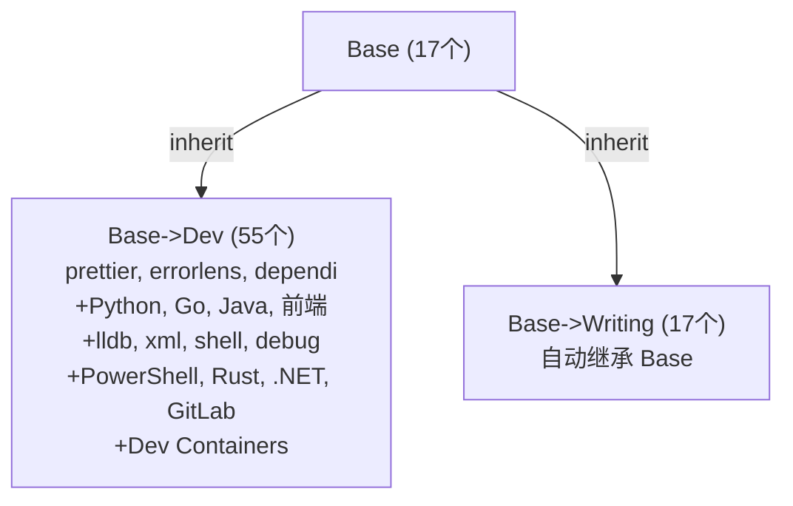

# VS Code Profile 体系 · 完整架构文档

> 最后更新: 2026-07-17

---

## 一、整体架构

```
Base（通用底座·17个）
├── Base->Dev（通用开发工具·55个）
└── Base->Writing（文字写作·17个，自动继承 Base）

Test（未归类文档工具，3个，仅文档规划）
```

---

## 二、Profile 明细

### 2.1 Base · 通用底座（17 个扩展）

**UUID:** `10a9f58d`

**继承:** 无（根 Profile）

**Settings:**

```json
{
    "inheritProfile.runOnStartup": true,
    "inheritProfile.runOnProfileChange": true,
    "git.autofetch": true,
    "gitlens.ai.model": "vscode",
    "gitlens.ai.vscode.model": "opencode-go:minimax",
    "diffEditor.renderSideBySide": false,
    "chat.tools.urls.autoApprove": {
        "https://code.visualstudio.com": true,
        "https://github.com/microsoft/vscode/wiki/*": true,
        "https://github.com": {
            "approveRequest": false,
            "approveResponse": true
        },
        "https://opencode.ai": true
    },
    "chat.agent.maxRequests": 300,
    "opencodego.enableZenFreeModels": true,
    "explorer.confirmDelete": false,
    "chat.utilitySmallModel": "opencodego/deepseek-v4-flash",
    "chat.viewSessions.orientation": "stacked",
    "chat.mcp.gallery.enabled": true,
    "terminal.integrated.commandsToSkipShell": [
        "kilo-code.new.agentManagerOpen",
        "kilo-code.new.agentManager.showTerminal"
    ],
    "opencodego.commitIncludeCommitDiff": true,
    "opencodego.temperature": 0,
    "opencodego.top_p": 0
}
```

> ⚠️ 注意：Base 是根 Profile，`inheritProfile.runOnProfileChange` 不会产生实际影响（无父 Profile 可继承）

**扩展列表:**

| 扩展 ID                                   | 名称                 | 用途                  |
| ----------------------------------------- | -------------------- | --------------------- |
| `eamodio.gitlens`                         | GitLens              | Git 增强              |
| `github.codespaces`                       | GitHub Codespaces    | 云端开发              |
| `github.vscode-pull-request-github`       | GitHub Pull Requests | PR 管理               |
| `ms-ceintl.vscode-language-pack-zh-hans`  | Chinese (Simplified) | 中文汉化              |
| `vscode-icons-team.vscode-icons`          | vscode-icons         | 文件图标主题          |
| `vizards.deepseek-v4-for-copilot`         | DeepSeek V4          | Copilot 模型          |
| `denizhandaklr.glm-chat-provider`         | GLM Chat             | Copilot 模型          |
| `denizhandaklr.kimi-lm-provider`          | Kimi                 | Copilot 模型          |
| `denizhandaklr.minimax-vscode`            | MiniMax              | Copilot 模型          |
| `kisstkondoros.vscode-gutter-preview`     | Image preview        | 图片预览              |
| `luotianyiismywife.ghcp-dashboard`        | GHCP Dashboard       | GitHub Copilot 仪表盘 |
| `luotianyiismywife.inherit-profile-plus`  | Inherit Profile Plus | 继承工具              |
| `onesoftqwq.opencode-go-copilot-provider` | OpenCode Go          | Copilot 适配          |
| `yzhang.markdown-all-in-one`              | Markdown All in One  | Markdown 增强         |
| `mushan.vscode-paste-image`               | Paste Image          | 粘贴图片              |
| `davidanson.vscode-markdownlint`          | markdownlint         | Markdown 规范检查     |
| `shd101wyy.markdown-preview-enhanced`     | Markdown Preview Enhanced | Markdown 增强预览 |

---

### 2.2 Base->Dev · 通用开发（55 个扩展，含继承自 Base）

**UUID:** `-367578e4`

**继承:** `inheritProfile.parents: ["Base"]`

**Settings:**

```json
{
    "inheritProfile.parents": ["Base"],
    "inheritProfile.runOnStartup": true,
    "inheritProfile.runOnProfileChange": true,
    "inheritProfile.showMessages": false,
    "editor.defaultFormatter": "esbenp.prettier-vscode",
    "editor.formatOnSave": true,
    "gitlens.ai.model": "vscode",
    "gitlens.ai.vscode.model": "copilotcli:",
    "git.autofetch": true
}
```

> ⚠️ 子 Profile 中还包含继承自 Base 的 inherited settings 块（由 `inherit-profile-plus` 自动管理），此处不重复列出

**扩展列表:**

| 扩展 ID                                  | 名称                       | 用途              |
| ---------------------------------------- | -------------------------- | ----------------- |
| `ms-vscode-remote.remote-ssh`            | Remote - SSH               | SSH 远程连接      |
| `ms-vscode.remote-explorer`              | Remote Explorer            | 远程资源管理器    |
| `ms-vscode-remote.remote-ssh-edit`       | Remote SSH: Edit           | SSH Config 编辑   |
| `esbenp.prettier-vscode`                 | Prettier                   | 跨语言格式化      |
| `usernamehw.errorlens`                   | Error Lens                 | 内联错误提示      |
| `fill-labs.dependi`                      | Dependi                    | 跨语言依赖管理    |
| `gerrnperl.outline-map`                  | Outline Map                | 代码大纲图        |
| `vadimcn.vscode-lldb`                    | CodeLLDB                   | 调试器            |
| `redhat.vscode-xml`                      | XML                        | XML 支持          |
| `luotianyiismywife.inherit-profile-plus` | Inherit Profile Plus       | 继承工具          |
| `ms-python.python`                       | Python                     | Python 语言支持   |
| `ms-python.debugpy`                      | Python Debugger            | Python 调试器     |
| `ms-python.vscode-pylance`               | Pylance                    | Python 语言服务   |
| `ms-python.vscode-python-envs`           | Python Environment Manager | Python 环境管理   |
| `golang.go`                              | Go                         | Go 语言支持       |
| `redhat.java`                            | Language Support for Java  | Java 语言支持     |
| `vscjava.vscode-java-debug`              | Debugger for Java          | Java 调试器       |
| `vscjava.vscode-java-dependency`         | Java Dependency Viewer     | Java 依赖管理     |
| `vscjava.vscode-java-pack`               | Extension Pack for Java    | Java 扩展包       |
| `vscjava.vscode-java-test`               | Java Test Runner           | Java 测试         |
| `vscjava.vscode-maven`                   | Maven for Java             | Maven 支持        |
| `vscjava.vscode-gradle`                  | Gradle for Java            | Gradle 支持       |
| `ecmel.vscode-html-css`                  | HTML CSS Support           | HTML/CSS 补全     |
| `xabikos.javascriptsnippets`             | JavaScript (ES6) Snippets  | JS 代码片段       |
| `formulahendry.auto-rename-tag`          | Auto Rename Tag            | HTML 标签同步改名 |
| `pranaygp.vscode-css-peek`               | CSS Peek                   | CSS 定义跳转      |
| `sporiley.css-auto-prefix`               | CSS Auto Prefix            | CSS 前缀补全      |
| `vincaslt.highlight-matching-tag`        | Highlight Matching Tag     | 标签高亮          |
| `foxundermoon.shell-format`              | shell-format               | Shell 格式化      |
| `ritwickdey.liveserver`                  | Live Server                | 本地开发服务器    |
| `firefox-devtools.vscode-firefox-debug`  | Firefox Debugger           | Firefox 调试      |
| `ms-edgedevtools.vscode-edge-devtools`   | Edge DevTools              | Edge 调试         |
| `tamasfe.even-better-toml`               | Even Better TOML           | TOML 支持         |
| `ms-vscode.powershell`                   | PowerShell                 | PowerShell 支持   |
| `rust-lang.rust-analyzer`                | rust-analyzer              | Rust 语言支持     |
| `barbosshack.crates-io`                  | crates-io                  | Rust Crate 管理   |
| `gitlab.gitlab-workflow`                 | GitLab Workflow            | GitLab 集成       |
| `ms-dotnettools.vscode-dotnet-runtime`   | .NET Runtime               | .NET 运行时       |
| `ms-azuretools.vscode-containers`        | Dev Containers             | 容器开发环境      |

### 2.4 Base->Writing · 文字写作（17 个扩展，含继承自 Base，由 inherit-profile-plus 自动管理）

**UUID:** `-332dce57`

**继承:** `inheritProfile.parents: ["Base"]`

**Settings:**

```json
{
    "inheritProfile.parents": ["Base"],
    "inheritProfile.runOnStartup": true,
    "inheritProfile.runOnProfileChange": true,
    "inheritProfile.showMessages": false,
    "git.autofetch": true
}
```

> ⚠️ 子 Profile 中还包含继承自 Base 的 inherited settings 块（由 `inherit-profile-plus` 自动管理），此处不重复列出

**扩展列表:**

与 **Base** 完全一致（17 个），由 `inherit-profile-plus` 在启动/切 Profile 时自动同步。无需手动维护。

---

---

### 2.5 Default Profile（57 个扩展 · 全局存储）

**UUID:** `__default__profile__`（特殊，无独立目录）

**Settings**（实际继承 Base 后包含 inherited 块，以下仅列出 Default 自身设置）:

```json
{
  "editor.defaultFormatter": "esbenp.prettier-vscode",
  "liveServer.settings.donotShowInfoMsg": true,
  "[python]": { "editor.formatOnType": true },
  "[shellscript]": { "editor.defaultFormatter": "foxundermoon.shell-format" },
  "[go]": { "editor.defaultFormatter": "golang.go" },
  "[rust]": {},
  "redhat.telemetry.enabled": true,
  "cmake.configureOnOpen": true,
  "vscode-edge-devtools.webhintInstallNotification": true,
  "wikitext.autoLogin": "Never",
  "lldb.dbgconfig": {},
  "window.newWindowProfile": "Base",
  "git.autofetch": true,
  "explorer.confirmDelete": false,
  "gitlens.ai.model": "vscode",
  "gitlens.ai.vscode.model": "copilot:gpt-4o-mini",
  "chat.mcp.gallery.enabled": true,
  "task.allowAutomaticTasks": "on"
}
```

**扩展列表（57 个）** — 全局安装，所有 Profile 可见，但各 Profile 的 `extensions.json` 决定哪些启用。

| 类别          | 扩展                                                                                                                                                                                                                                 |
| ------------- | ------------------------------------------------------------------------------------------------------------------------------------------------------------------------------------------------------------------------------------ |
| 🔀 Git        | `eamodio.gitlens`, `github.codespaces`, `github.vscode-pull-request-github`                                                                                                                                                          |
| 🌏 汉化       | `ms-ceintl.vscode-language-pack-zh-hans`                                                                                                                                                                                             |
| 🎨 美化       | `vscode-icons-team.vscode-icons`, `maxdavidwow.remix-light`                                                                                                                                                                          |
| 🔌 远程       | `ms-vscode-remote.remote-ssh`, `ms-vscode.remote-explorer`, `ms-vscode-remote.remote-ssh-edit`                                                                                                                                       |
| 📝 Markdown   | `yzhang.markdown-all-in-one`, `shd101wyy.markdown-preview-enhanced`, `davidanson.vscode-markdownlint`                                                                                                                                |
| 🖼️ 工具       | `kisstkondoros.vscode-gutter-preview`, `mushan.vscode-paste-image`                                                                                                                                                                   |
| 🐍 Python     | `ms-python.python`, `ms-python.debugpy`, `ms-python.vscode-pylance`, `ms-python.vscode-python-envs`                                                                                                                                  |
| 🐹 Go         | `golang.go`                                                                                                                                                                                                                          |
| ☕ Java       | `redhat.java`, `vscjava.vscode-java-debug`, `vscjava.vscode-java-dependency`, `vscjava.vscode-java-pack`, `vscjava.vscode-java-test`, `vscjava.vscode-maven`, `vscjava.vscode-gradle`                                                |
| 🌐 前端       | `ecmel.vscode-html-css`, `xabikos.javascriptsnippets`, `formulahendry.auto-rename-tag`, `pranaygp.vscode-css-peek`, `sporiley.css-auto-prefix`, `vincaslt.highlight-matching-tag`, `esbenp.prettier-vscode`, `ritwickdey.liveserver` |
| 🔧 工具       | `foxundermoon.shell-format`, `vadimcn.vscode-lldb`, `tamasfe.even-better-toml`, `redhat.vscode-xml`, `sergey-tihon.openxml-explorer`, `fill-labs.dependi`, `usernamehw.errorlens`, `gerrnperl.outline-map`, `barbosshack.crates-io`, `luotianyiismywife.inherit-profile-plus` |
| 🔥 调试       | `firefox-devtools.vscode-firefox-debug`, `ms-edgedevtools.vscode-edge-devtools`                                                                                                                                                      |
| 🤖 Git 平台   | `gitlab.gitlab-workflow`                                                                                                                                                                                                             |
| 📄 文档       | `rowewilsonfrederiskholme.wikitext`, `yuenm18.ooxml-viewer`                                                                                                                                                                          |
| ⚙️ 其他       | `ms-dotnettools.vscode-dotnet-runtime`                                                                                                                                                                                               |
| 🖥️ PowerShell | `ms-vscode.powershell`                                                                                                                                                                                                              |
| 🦀 Rust       | `rust-lang.rust-analyzer`                                                                                                                                                                                                           |
| 🤖 Copilot 模型 | `vizards.deepseek-v4-for-copilot`, `denizhandaklr.glm-chat-provider`, `denizhandaklr.kimi-lm-provider`, `denizhandaklr.minimax-vscode`, `denizhandaklr.opencode-go-for-copilot`                                                    |

---

### 2.6 未归类扩展（5 个 · 未加入任何自定义 Profile）

**说明:** 以下扩展全局已安装，但未加入 Base/Dev/Writing 任一自定义 Profile。仅在 Default Profile 中可用。

| 扩展 ID | 名称 | 用途 |
|---------|------|------|
| `rowewilsonfrederiskholme.wikitext` | WikiText | Wiki 文档编辑 |
| `sergey-tihon.openxml-explorer` | OpenXML Explorer | Office XML 查看器 |
| `yuenm18.ooxml-viewer` | OOXML Viewer | OOXML 文件查看 |
| `denizhandaklr.opencode-go-for-copilot` | OpenCode Go (Alt) | Copilot 模型（备用） |
| `maxdavidwow.remix-light` | Remix Light | 浅色主题 |

---

## 三、继承关系图



---

## 五、关键文件路径

| 内容             | 路径                                                                  |
| ---------------- | --------------------------------------------------------------------- |
| Profile 目录     | `%APPDATA%\Code\User\profiles\`                                       |
| Profile 注册表   | `%APPDATA%\Code\User\globalStorage\storage.json` → `userDataProfiles` |
| 全局扩展安装目录 | `%USERPROFILE%\.vscode\extensions\`                                   |
| 全局扩展清单     | `%USERPROFILE%\.vscode\extensions\extensions.json`                    |
| 用户设置         | `%APPDATA%\Code\User\settings.json`                                   |
| Profile 缓存     | `%APPDATA%\Code\CachedProfilesData\`                                  |
| state 数据库     | `%APPDATA%\Code\User\globalStorage\state.vscdb`                       |

---

## 六、注意事项

1. **Profile 注册信息存在 SQLite 数据库中**（`state.vscdb`），手动改 `storage.json` 会在重启时被覆盖
2. **扩展文件在全局**（`extensions/`），Profile 的 `extensions.json` 只是"引用清单"
3. **`inherit-profile-plus` 扩展** 需要在子 Profile 中也安装才能工作
4. **Profile 名称中的 `->`** 只是命名约定，无实际语义

---

## 七、修改本地扩展的工作流程

> **核心理念：** 一个扩展的改动需要同步 **两处**——本 Markdown 文档 + 实际 Profile 的 `extensions.json` 文件。

### 7.1 常见场景

| 场景 | 说明 |
|------|------|
| **新增扩展** | 安装后加入指定 Profile 的扩展清单 |
| **移除扩展** | 从某 Profile 取消勾选（卸载则全局移除） |
| **跨 Profile 移动** | 从 A Profile 移到 B Profile（如 Base → Dev） |

### 7.2 修改步骤

#### 步骤一：更新本 Markdown 文档

找到文档中对应的 Profile 表格，执行以下操作：

- **新增**：在表格末尾追加一行 `\| <扩展ID> \| <名称> \| <用途> \|`
- **删除**：移除该扩展所在的行
- **移动**：从源 Profile 表格删除，在目标 Profile 表格中添加

同时更新以下受影响的计数值：

| 位置 | 需同步 |
|------|--------|
| 一、整体架构（Base/Dev/Writing 个数） | Base/Writing 增减时更新 |
| 各 Profile 标题括号内的个数 | 对应 Profile 增减时更新 |
| Base->Writing 说明文字中的个数 | Base 增减时同步更新 |
| Default Profile 标题与描述中的个数 | 全局扩展总数变化时更新 |
| 三、Mermaid 继承关系图 | Base/Writing 个数变化时更新 |

#### 步骤二：更新本地 Profile 文件

找到对应 Profile 目录下的 `extensions.json`：

```
%APPDATA%\Code\User\profiles\<UUID>\extensions.json
```

| Profile | UUID 目录 |
|---------|-----------|
| Base | `10a9f58d` |
| Base->Dev | `-367578e4` |
| Base->Writing | `-332dce57` |

**JSON 结构说明：**

```json
{
  "identifier": {
    "id": "publisher.extension-name",
    "uuid": "全局唯一标识"
  },
  "version": "x.y.z",
  "location": { "$mid": 1, "path": "扩展安装路径", "scheme": "file" },
  "relativeLocation": "publisher.extension-name-x.y.z",
  "metadata": {
    "installedTimestamp": 时间戳,
    "pinned": false,
    "source": "gallery",
    "id": "uuid",
    "publisherId": "uuid",
    "publisherDisplayName": "发布者",
    "targetPlatform": "undefined",
    "updated": false,
    "private": false,
    "isPreReleaseVersion": false,
    "hasPreReleaseVersion": false,
    "preRelease": false
  }
}
```

操作方式（任选其一）：

<details>
<summary><b>方式 A：使用 PowerShell 脚本（推荐，精确可靠）</b></summary>

```powershell
# 读取
$profilePath = "$env:APPDATA\Code\User\profiles\<UUID>\extensions.json"
$ext = Get-Content $profilePath -Raw | ConvertFrom-Json

# 新增：先在 VS Code 安装扩展，再从全局已安装清单中找到其完整对象
# 查看全局清单：%USERPROFILE%\.vscode\extensions\extensions.json
$globalExt = Get-Content "$env:USERPROFILE\.vscode\extensions\extensions.json" -Raw | ConvertFrom-Json
$newExt = $globalExt | Where-Object { $_.identifier.id -eq "publisher.extension-name" }
$ext = $ext + $newExt   # 追加到末尾

# 删除：按 identifier.id 过滤排除
$ext = $ext | Where-Object { $_.identifier.id -ne "publisher.extension-name" }

# 写出（-Compress 保持单行紧凑格式）
$ext | ConvertTo-Json -Depth 10 -Compress | Set-Content $profilePath -Encoding UTF8
```
</details>

<details>
<summary><b>方式 B：手动编辑（少量修改时可用）</b></summary>

1. 在 VS Code 中打开 `%APPDATA%\Code\User\profiles\<UUID>\extensions.json`
2. 按 JSON 格式增删对应的扩展对象（注意数组逗号）
3. 保存文件
</details>

#### 步骤三：验证

```powershell
# 检查某扩展是否存在于 Profile 中
Select-String -Path "$env:APPDATA\Code\User\profiles\10a9f58d\extensions.json" -Pattern "extension-name" -SimpleMatch

# 统计 Profile 扩展数量
(Get-Content "$env:APPDATA\Code\User\profiles\10a9f58d\extensions.json" -Raw | ConvertFrom-Json).Count
```

### 7.3 典型操作示例

#### 例：新增一个扩展到 Dev

```powershell
$devPath = "$env:APPDATA\Code\User\profiles\-367578e4\extensions.json"
$devExt = Get-Content $devPath -Raw | ConvertFrom-Json

# 从全局已安装清单中找到目标扩展
$globalExt = Get-Content "$env:USERPROFILE\.vscode\extensions\extensions.json" -Raw | ConvertFrom-Json
$newExt = $globalExt | Where-Object { $_.identifier.id -eq "publisher.new-extension" }

# 追加并写出
$devExt = $devExt + $newExt
$devExt | ConvertTo-Json -Depth 10 -Compress | Set-Content $devPath -Encoding UTF8
```

#### 例：跨 Profile 移动（如 Base → Dev）

```powershell
$basePath = "$env:APPDATA\Code\User\profiles\10a9f58d\extensions.json"
$devPath = "$env:APPDATA\Code\User\profiles\-367578e4\extensions.json"

$baseExt = Get-Content $basePath -Raw | ConvertFrom-Json
$devExt = Get-Content $devPath -Raw | ConvertFrom-Json

$targetIds = @("publisher.ext-a", "publisher.ext-b")

# 从 Base 取出，追加到 Dev
$moving = $baseExt | Where-Object { $_.identifier.id -in $targetIds }
$newBase = $baseExt | Where-Object { $_.identifier.id -notin $targetIds }
$newDev = $moving + $devExt   # 插入到 Dev 列表开头

$newBase | ConvertTo-Json -Depth 10 -Compress | Set-Content $basePath -Encoding UTF8
$newDev | ConvertTo-Json -Depth 10 -Compress | Set-Content $devPath -Encoding UTF8
```

### 7.4 注意事项

- ⚠️ **一定要两处都改**（文档 + Profile 文件），否则文档与实际不同步
- 🔄 如果扩展现已在 Base->Dev 中（通过继承可见），**不需要**在 Dev 的 `extensions.json` 中重复添加——除非你想让 Dev 在断开继承时仍保留该扩展
- 📦 扩展本身是全局安装的（`%USERPROFILE%\.vscode\extensions\`），Profile 的 `extensions.json` 只是"引用清单"，增删引用**不会**影响扩展文件本身
- 🔁 VS Code 会缓存 Profile 信息，改动 `extensions.json` 后建议重启 VS Code 或切换 Profile 使其生效
- ⚡ **`inherit-profile-plus` 扩展继承机制**：子 Profile 中来自父 Profile 的扩展会被标记 `inheritedFromProfile`。同步时，先移除所有带标记的扩展，再从父 Profile 重新收集。因此父 Profile **增删扩展会自动同步到子 Profile**。子自己独有的扩展不受影响。
